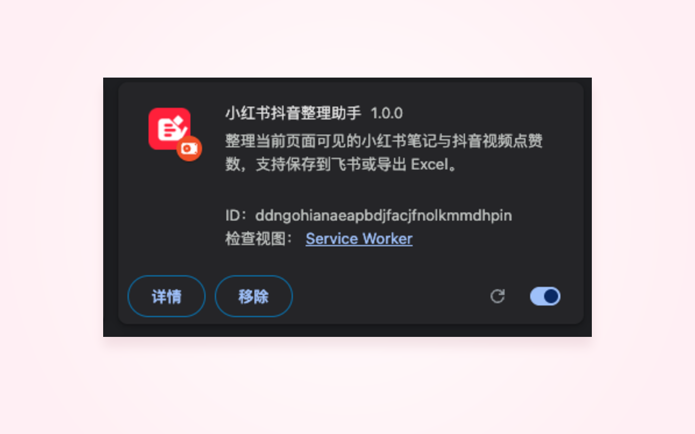
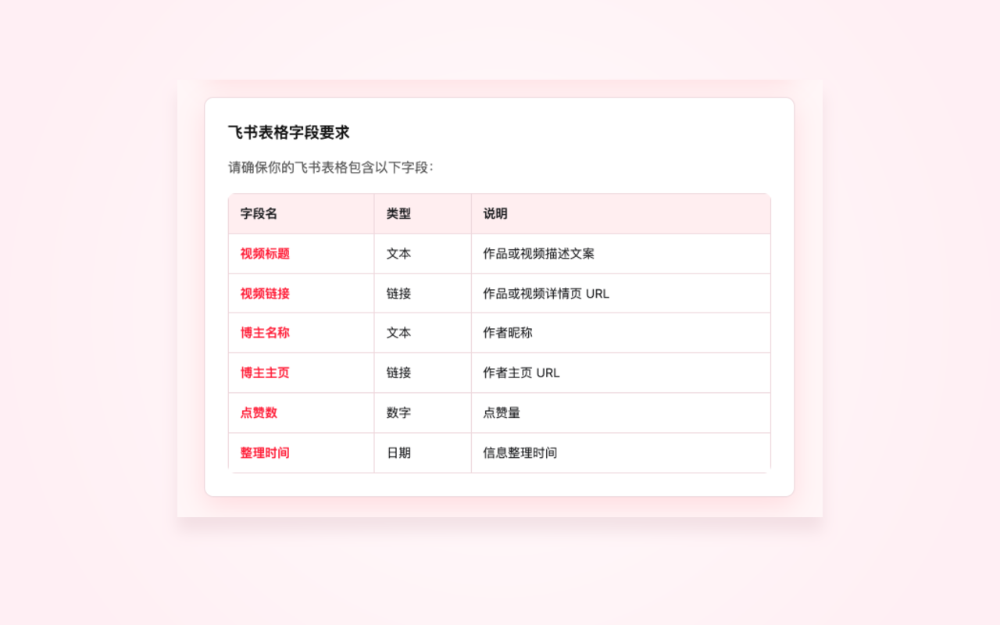

# 小红书抖音整理助手 - Chrome 扩展

整理当前页面可见的小红书笔记与抖音视频基础信息和点赞数，按最低点赞数筛选，支持保存到飞书多维表格或导出 Excel。


> 本扩展为非官方辅助工具，与小红书、抖音、飞书官方无隶属、背书或授权关系。请仅在遵守相关平台规则和法律法规的前提下，用于整理你当前页面可见的公开信息。

---

## 项目来源与致谢

本项目基于 [WardLu/Douyin-Collector](https://github.com/WardLu/Douyin-Collector) 二次开发，感谢原作者 WardLu 的开源项目。

在原项目基础上，本项目扩展了小红书作品识别、点赞数整理、飞书多维表格保存、本地 Excel 导出、Chrome 扩展交互界面等能力。

---

## 🚀 安装方法

### 1. 加载扩展

1. 打开 Chrome 浏览器，访问 `chrome://extensions/`
2. 打开右上角的 **「开发者模式」** 开关
3. 点击 **「加载已解压的扩展程序」**
4. 选择本项目文件夹



### 2. 配置飞书信息

如果需要保存到飞书多维表格，请点击扩展图标 → 设置，填写飞书应用和多维表格信息。仅导出 Excel 时可以跳过这一步。飞书配置仅保存在当前浏览器本地，建议使用专用飞书自建应用，不要复用高权限应用。

| 配置项     | 说明                               |
| ---------- | ---------------------------------- |
| App ID     | 飞书自建应用的 App ID              |
| App Secret | 飞书自建应用的 App Secret          |
| Base ID    | 多维表格 URL 中 `/base/` 后的 ID |
| Table ID   | 多维表格 URL 中 `table=` 后的 ID |

### 3. 添加文档应用权限

**重要**：如果需要保存到飞书，首次使用前需在飞书表格中添加应用权限：

1. 打开飞书多维表格
2. 点击右上角 `...` → `更多` → `添加文档应用`
3. 搜索并添加应用

---

## 📖 使用方法

1. 访问抖音或小红书博主主页（如 `https://www.douyin.com/user/xxx` 或 `https://www.xiaohongshu.com/user/profile/xxx`）
2. **滚动页面**加载更多作品或视频
3. 点击扩展图标
4. 输入最低点赞数筛选条件（可选）
5. 点击 **「开始整理」**
6. 点击 **「导出 Excel」** 或 **「保存到飞书表格」**

### 操作流程截图

先打开插件，可以直接跳转到抖音或小红书。


进入博主主页后，插件会识别当前主页。如果只想整理高赞内容，可以填写最低点赞数；留空则整理当前页面已加载出的全部内容。


点击开始整理后，可以预览整理结果，并选择导出 Excel 或保存到飞书表格。


---

## 📋 飞书表格字段要求

| 字段名   | 类型 | 说明                 |
| -------- | ---- | -------------------- |
| 视频标题 | 文本 | 作品或视频描述文案   |
| 视频链接 | 链接 | 作品或视频详情页 URL |
| 博主名称 | 文本 | 作者昵称             |
| 博主主页 | 链接 | 作者主页 URL         |
| 点赞数   | 数字 | 点赞量               |
| 整理时间 | 日期 | 信息整理时间         |

配置页面需要填写飞书应用和表格信息，保存后即可把整理结果写入对应多维表格。


请确保飞书多维表格里包含上方字段，字段名需要和文档保持一致。



---

## 📁 文件结构

```
rednote-douyin-organizer/
├── manifest.json      # 扩展配置
├── content_douyin.js  # 抖音当前页面可见信息读取
├── content_xhs.js     # 小红书当前页面可见信息读取
├── background.js      # 飞书 API 调用（批量创建）
├── popup.html/js/css  # 操作面板
├── options.html/js/css# 设置页面
├── feedback.html/css  # 用户反馈页面
└── icons/             # 扩展图标
```

---

## ⚠️ 注意事项

1. **需要手动滚动**：插件只能整理当前页面已加载的作品或视频
2. **当前只整理点赞数**：插件不会整理播放数、评论数、收藏数或转发数
3. **建议先登录**：如果整理数量明显少于页面实际展示数量，请先登录小红书或抖音账号，再刷新并滚动加载后重新整理
4. **页面结构变化**：小红书或抖音可能更新页面结构导致整理失败
5. **数据精度**：部分点赞数为简写形式（如"10.5万"）会自动转换
6. **合规使用**：本扩展为非官方工具，仅用于整理当前页面可见的公开信息，请遵守平台使用条款和相关法律法规

---

## 🔧 技术说明

- **框架**：Chrome Extension Manifest V3
- **兼容性**：Chrome 88+
- **信息读取**：DOM 解析当前页面已加载作品的基础信息和点赞数
- **API 调用**：飞书开放平台 Bitable API（批量创建）

---

## 📄 更新日志

### v1.0.0 (2026-01-06)

- ✅ 作品基础信息与点赞数整理
- ✅ 点赞数筛选
- ✅ 批量保存到飞书
- ✅ 本地导出 Excel
- ✅ 无关内容过滤
