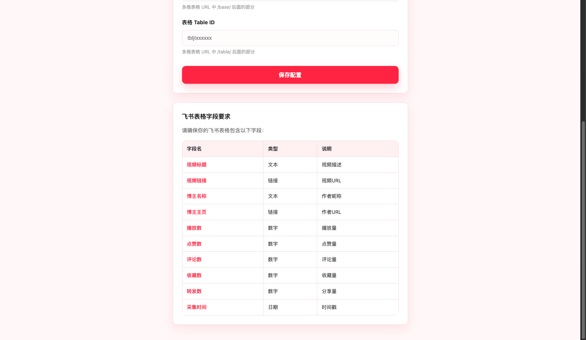
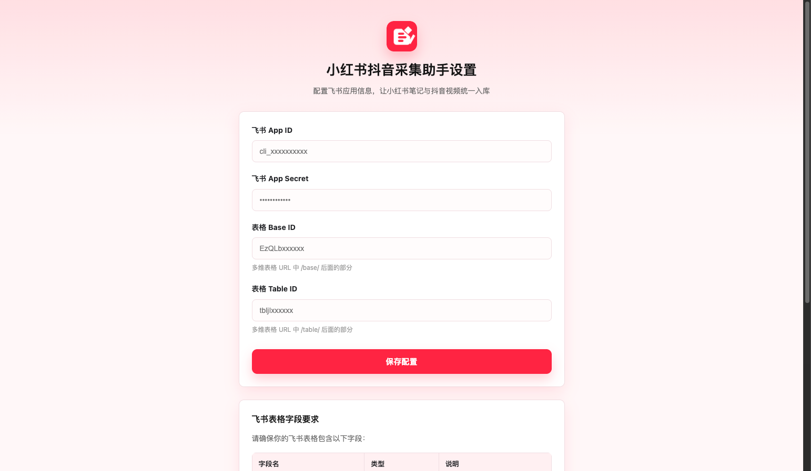
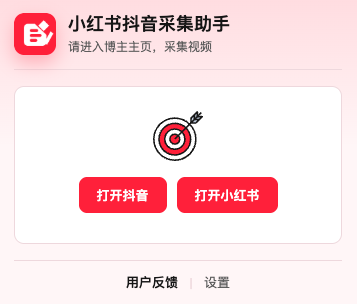
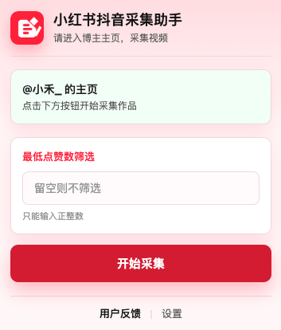
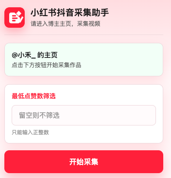
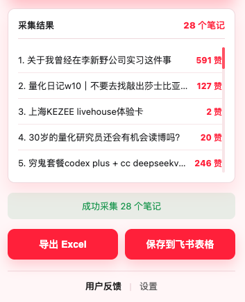

# 小红书抖音采集助手 - 用户操作手册

欢迎使用 **小红书抖音采集助手**！这是一款能帮你把小红书/抖音博主的高赞作品保存到飞书表格，或直接导出为 Excel 的工具。无论你是做竞品分析、素材收集，还是寻找爆款灵感，它都能帮你减少重复整理工作。

本文档将带你一步步上手，从零开始搭建你的自动化采集流。

---

## 场景一：初次见面（安装插件）

在使用之前，我们需要先把这个小助手请到你的 Chrome 浏览器里。

1. **下载插件包**：找到你收到的项目文件夹，确保它已经解压。
2. **打开扩展中心**：在 Chrome 浏览器地址栏输入 `chrome://extensions/` 并回车。
3. **开启开发者模式**：点击页面右上角的**「开发者模式」**开关，把它变成蓝色。
4. **加载插件**：点击左上角的**「加载已解压的扩展程序」**按钮。
5. **选择文件夹**：在弹出的窗口中，选中项目文件夹并确定。
6. **完成**：看到带有红白图标的“小红书抖音采集助手”出现，就说明安装成功啦！

---

## 场景二：打造仓库（配置飞书表格）

如果你需要把数据保存到飞书，这是最关键的一步。我们需要在飞书里准备一个“仓库”（多维表格），并给插件一把“钥匙”（API 授权），这样插件才能把采集到的作品或视频数据放进去。如果你只需要导出 Excel，可以先跳过这一场景。

### 第一步：创建飞书应用（获取钥匙）

1. 登录 [飞书开放平台](https://open.feishu.cn/app)。
2. 点击右上角**「创建企业自建应用」**。
3. 填写应用名称（例如“小红书抖音采集助手”），点击**「创建」**。
4. 在左侧菜单点击**「凭证与基础信息」**，你会在页面上看到两个重要信息，请记下来：
   * **App ID**（例如 `cli_a9d...`）
   * **App Secret**（例如 `zJp8...`）
5. 点击左侧菜单**「权限管理」**，搜索并添加以下权限：
   * `多维表格-数据: 写入` (`bitable:record:write` 或类似名称)
   * `多维表格: 读取`
   * *提示：如果不确定，也可以把搜出来的多维表格相关权限都选上。*
6. 点击**「版本管理与发布」**，点击**「创建版本」**并**「发布」**。
   * *注意：一定要发布后，权限才会生效！*

### 第二步：创建多维表格（准备仓库）

1. 在飞书云文档中，新建一个**多维表格**。
2. 我们需要按顺序修改或添加以下列（**表头名称必须完全一致，否则无法保存**）：
   | 列名               | 类型   | 说明                         |
   | :----------------- | :----- | :--------------------------- |
   | **视频标题** | 文本   |                              |
   | **视频链接** | 超链接 |                              |
   | **博主名称** | 文本   |                              |
   | **博主主页** | 超链接 |                              |
   | **播放数**   | 数字   |                              |
   | **点赞数**   | 数字   |                              |
   | **评论数**   | 数字   |                              |
   | **收藏数**   | 数字   |                              |
   | **转发数**   | 数字   |                              |
   | **采集时间** | 日期   | 格式建议选“年/月/日 时:分” |

插件设置页里也列出了字段要求，可以对照检查表头是否准备完整。

### 第三步：获取表格 ID（定位仓库）

打开你刚才创建的表格，观察浏览器顶部的网址（URL）：

`https://yourname.feishu.cn/base/bascnXXXXXXXXXX?table=tblYYYYYYYYYY`

* **Base ID (应用 ID)**：`bascn` 开头的那一串字符（直到 `?` 之前）。
* **Table ID (数据表 ID)**：`table=` 后面那串以 `tbl` 开头的字符。

> **示例**：
> 网址：`https://.../base/bascnABCD1234?table=tblZr98765`
>
> * Base ID = `bascnABCD1234`
> * Table ID = `tblZr98765`

### 第四步：添加应用授权（给仓库开门）

**这一步非常重要！90% 的保存失败都是因为漏了这一步。**

1. 在你的多维表格页面右上角，点击 **「...」** (或「扩展」图标)。
2. 选择 **「添加文档应用」**（在“更多”菜单里）。
3. 搜索你刚才创建的应用名称（例如“小红书抖音采集助手”）。
4. 点击 **「添加」**。

---

## 场景三：建立连接（配置插件）

仓库准备好了，现在要把钥匙交给插件。如果只导出 Excel，不需要填写这些配置。

1. 在 Chrome 浏览器右上角，点击“小红书抖音采集助手”的图标。
2. 在弹出的窗口底部，点击**「设置」**。
3. 在设置页面填入刚才获取的 4 个信息：
   * 飞书 App ID
   * 飞书 App Secret
   * 多维表格 Base ID
   * 多维表格 Table ID
4. 点击**「保存配置」**。

设置页会把 App ID、App Secret、Base ID 和 Table ID 集中保存，后续采集结果才能一键写入飞书。

---

## 场景四：开始采集

一切准备就绪，让我们开始采集数据吧！

1. **进入主页**：打开 Chrome 浏览器，访问一位抖音或小红书博主的主页（例如 `www.douyin.com/user/xxxx` 或 `www.xiaohongshu.com/user/profile/xxxx`）。
2. **加载内容**：用鼠标向下滚动页面，加载出你想采集的作品或视频。
   * *注意：插件只能采集到当前页面已经加载出来的内容，想采多少就滚多少。*
3. **召唤助手**：点击浏览器右上角的“小红书抖音采集助手”图标。

如果还没有打开目标平台，可以先在插件首页点击按钮进入抖音或小红书。

进入博主主页后，插件会显示当前主页名称，说明已经识别到可采集页面。

4. **设定目标**（可选）：如果你只想要爆款，可以在“最低点赞数筛选”里输入数字（比如 `10000`）。留空则采集所有。

筛选框只接受整数；不填写时，插件会采集当前页面已加载出的全部作品或视频。

5. **开始采集**：点击**「开始采集」**按钮。
   * *插件会迅速展示采集到的内容列表和数据预览。*
   * *会自动过滤掉广告和无关内容。*
6. **导出或入库**：点击**「导出 Excel」**可直接下载表格文件；点击**「保存到飞书表格」**可将结果写入你配置的飞书多维表格。
   * *保存到飞书时，稍等片刻后会看到“保存成功”的提示。*

采集完成后，弹窗会展示作品标题、点赞数和采集数量，并提供导出与保存按钮。

---

## 常见问题 (FAQ)

**Q: 点击保存后提示 "Forbidden"？**
A: 这是权限问题。请检查【场景二：第四步】，确认你是否已经把飞书应用**添加**到了多维表格中。

**Q: 采集到的全是 0 点赞？**
A: 抖音页面结构偶尔会更新。请尝试刷新页面，等待内容完全加载后再采集。如果持续出现，请联系维护者更新插件。

**Q: 为什么只能采到一部分内容？**
A: 插件只会采集当前页面已经加载出来、且页面 DOM 中可读取的作品或视频。如果采集数量明显少于页面实际展示数量，请先确认已经登录小红书或抖音账号，再刷新页面，向下滚动加载更多内容后重新采集。

---

**祝你使用愉快！** 🎉

---

## 项目来源与致谢

本插件基于 [WardLu/Douyin-Collector](https://github.com/WardLu/Douyin-Collector) 二次开发，感谢原作者 WardLu 的开源项目。
